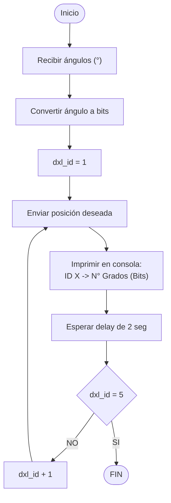

# Robotica 2025 I  Laboratorio No. 4
***Cinemática Directa - Phantom X - ROS***

Andrés Felipe Quenan Pozo - `aquenan@unal.edu.co`
***
# Introducción
El presente laboratorio tiene como propósito aplicar los conceptos de cinemática directa al brazo robótico Phantom X Pincher mediante ROS 2, integrando teoría y práctica en el modelado y control de manipuladores. A través de la identificación de parámetros Denavit-Hartenberg, el desarrollo de scripts en Python y la implementación de una interfaz gráfica, se busca controlar el movimiento secuencial de las articulaciones, visualizar sus posiciones en tiempo real y familiarizar al estudiante con la arquitectura y operación de un sistema robótico basado en ROS.

# Objetivos

* Identificar las longitudes de eslabón y establecer los parámetros DH del robot.
* Configurar los controladores articulares del Phantom X Pincher en ROS 2.
* Desarrollar un script en Python que permita mover el robot desde la posición “home” hasta una posición objetivo de forma secuencial.
* Leer y mostrar las posiciones actuales de las articulaciones en grados.
* Crear una interfaz gráfica para el control y visualización del estado del robot

# Desarrollo

## Mediciones
Se establecieron los eslabones, las articulaciones y posteriormente se establecieron las longitudes de eslabón para cada articulación del robot Phantom X Pincher utilizando un calibrador.


## Análisis
A partir del anterior diagrama se obtuvieron los parámetros DH del robot Phantom X Pincher.
   | i | θi | di | ai | α |
   | :---         |     :---:      |          :---: |          :---: |          :---: |
   | 1 | q1 | 113 | 0 | π/2 |
   | 2 | q2 | 0 | 100.7 | 0 |
   | 3 | q3 | 0 | 100.7 | 0 |
   | 4 | q4 | 0 | 85 | π/2 |
   
Cada uno de los servomotores que componen el robot, tienen un rango de -150° a 150° que se obtienen a partir de la posición en bits definida previamente ya que el rango consta de 0 a 1023 bits.

## ROS 2
La función `move_sequential` que se muestra a continuación está diseñada para ejecutar un movimiento ordenado, donde cada articulación del robot Phantom X Pincher se desplaza una tras otra hacia su posición objetivo. El proceso comienza convirtiendo los valores de entrada, expresados en grados, a valores en bits utilizando la fórmula de conversión específica para los servos Dynamixel. Luego, mediante un bucle, se envía el comando de posición a cada motor individualmente usando su identificador (`dxl_id`) y el valor objetivo convertido. Después de mover cada articulación, se genera una pausa controlada con `time.sleep()`, permitiendo que el movimiento sea claramente visible antes de que inicie el siguiente.

```
def move_sequential(self, degrees):
    bits = [deg_to_bits(d) for d in degrees]  # Convertir grados a bits
    for dxl_id, goal, deg in zip(self.dxl_ids, bits, degrees):
        self.packet.write2ByteTxRx(self.port, dxl_id, ADDR_GOAL_POSITION, goal)  # Enviar comando
        self.get_logger().info(f"ID {dxl_id} → {deg}° ({goal} bits)")           # Mostrar en consola
        time.sleep(self.delay)  # Espera para que se vea el movimiento secuencial
```

El diagrama de flujo se muestra a continuación:


## Conexión con Python

### Publicar en cada tópico de controlador validando límites articulares

El código encargado de publicar en cada tópico de controlador de articulación tiene como objetivo enviar comandos de movimiento a cada uno de los motores del robot, asegurando que dichos movimientos estén dentro de los límites articulares permitidos. Antes de publicar los valores convertidos en bits (a partir de grados ingresados), se realiza una validación para garantizar que los ángulos deseados no excedan el rango físico de operación de cada articulación.

La función `move_to_position` actua como publisher ya que publica los movimientos que deben realizar los servomotores, esto mediante el comando `write2ByteTxRx` que toma como parámetros el puerto, el ID del servomotor y la posición en bits.

```
def move_to_position(self, degrees):
    bits = [deg_to_bits(d) for d in degrees]
    for dxl_id, goal in zip(self.dxl_ids, bits):
        self.packet.write2ByteTxRx(self.port, dxl_id, ADDR_GOAL_POSITION, goal)
        time.sleep(self.delay)
```

EL diagrama de flujo se muestra a continuación:


### Suscribirse y retornar la configuración de 5 ángulos en grados
El código se encarga de suscribirse a los tópicos de estado de cada articulación y extraer la posición actual de los servos. Esta información, obtenida en bits, se convierte a grados utilizando una función específica y luego se presenta de forma comprensible. Esta funcionalidad es útil para conocer en tiempo real la configuración articular del robot.


